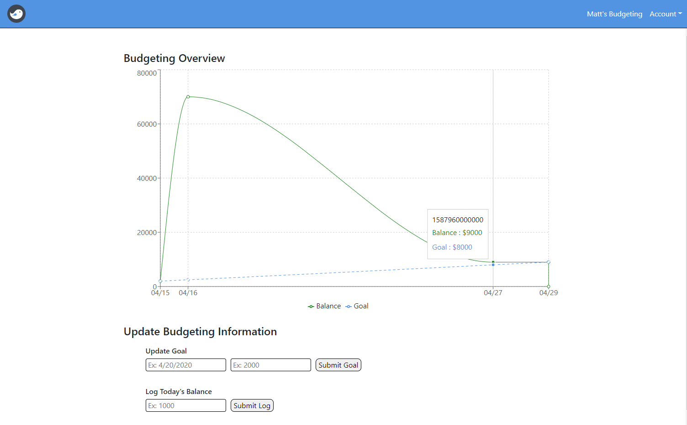
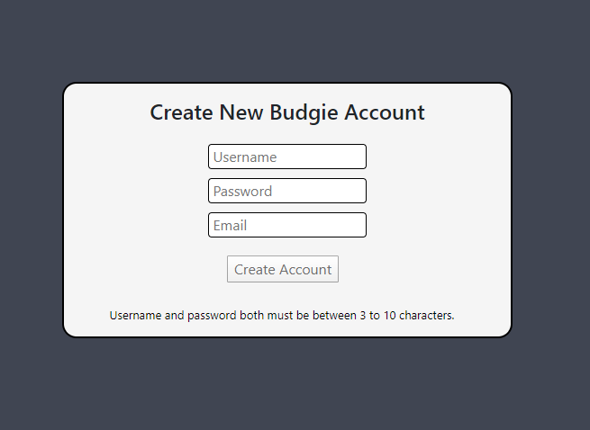
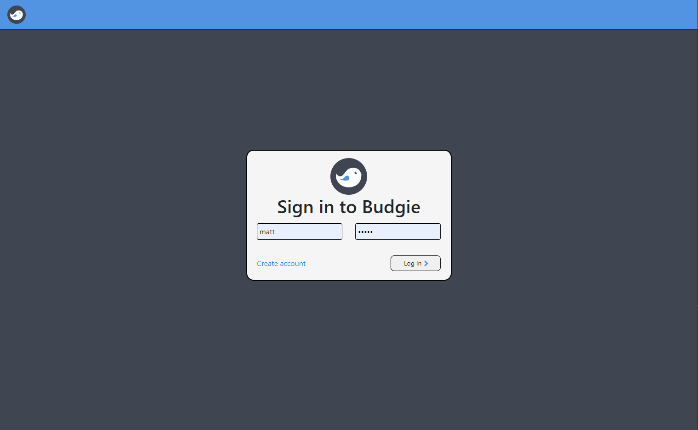

# budgie, a budgeting app

  

 

Budgie is an app created to help users visualize their financial progress. Once signing up with a valid email, a user can begin logging their daily balances as well as enter a financial goal. Users will see a personal graph showing their progress upon login.

  

 

  <i> Example of a user's dashboard. Green line shows actual progress, blue line shows goal projections. </i>

 

## Creating an account and signing in
To sign up, enter a unique username, a password, and a valid email.

All user information is stored in a `mongoDB` database, and passwords are encrypted with `bcrypt-js`.

  
  <i> Create account portal. </i>

To log in, simply enter your credentials and press 'Log In'.

  
  <i> Sign in page. </i>

## How we built it
The frontend was built with `React` and `Typescript` to create the user interface. `React-Redux` was used for state management, `React Router` for SPA routing, `recharts` to create graphs, and `axios` to make API calls to our backend.

The backend was built with `node.js`, `express.js`, `mongoose` to create APIs to interact with our `mongoDB` database.

Built by mhyeun and SJT00.
